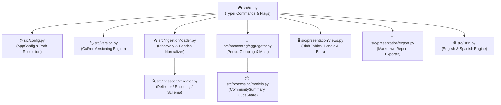

# 🤖 AGENTS.md — Development & Agent Guidelines

> Technical directives, architectural specifications, and domain invariants for autonomous AI agents and developers.

[](AGENTS.md)
[](https://astral.sh/ruff)
[](https://pre-commit.com/)
[](CONTRIBUTING.md)

---

## 1. 🎯 Project Mission & Core Capabilities

`datadis-analyzer` (`da`) is a modular CLI tool for analyzing hourly electricity consumption exported from Spain's [DATADIS](https://datadis.es) platform for residential communities (*comunidades de vecinos*).

### ⚡ Core Capabilities
- **📥 Robust Ingestion:** Ingest and validate DATADIS CSV files organized by year in `./.input/<year>/`. Auto-detect delimiters, encodings, and decimal formats.
- **🧮 Fair-Share Math:** Calculate exact percentage shares per CUPS for months and years (guaranteed 100.00% sum).
- **📊 Rich Terminal UI:** Render tables, metric cards, percentage bars, and consumption alerts (`★` dominant, `(0)` inactive).
- **⚙️ Configuration Persistence:** Maintain language preferences (`en`/`es`) and paths in `.da_config.json`.
- **📝 Automated Reporting:** Export timestamped Markdown summaries to `.output/YYYYMMDD_HHMMSS_*.md`.

---

## 2. 🧩 Architecture & Component Boundaries



### File Hierarchy
```text
datadis-analyzer/
├── pyproject.toml              # Build config, CLI entry point (da), Ruff config
├── requirements.txt            # Core and test dependency manifest
├── LICENSE                     # Standard MIT open-source license
├── README.md / AGENTS.md       # User guide and agent directives
├── CONTRIBUTING.md             # Contribution guidelines & Conventional Commits
├── .pre-commit-config.yaml     # Git hook definitions (Ruff linter, formatter, CalVer)
├── .da_config.json             # Persistent application configuration
├── .input/ / .output/          # Raw input CSVs (.input/<year>/) and generated reports
├── src/
│   ├── cli.py                  # Typer CLI application and command dispatch
│   ├── config.py / i18n.py     # Configuration, path resolution, and translations
│   ├── version.py              # CalVer version management and pre-commit enforcer
│   ├── ingestion/              # Delimiter detection, validation, and Pandas loader
│   ├── processing/             # Aggregation engine, domain models, and share math
│   └── presentation/           # Rich console UI, views, and Markdown exporter
└── tests/                      # Automated unit, integration, and CLI test suite
```

---

## 3. 🛠️ Technology Stack & Standards

| Component | Technology | Standard / Role |
| :--- | :--- | :--- |
| **Runtime** | Python 3.11+ | Modern typing, native union types (`X \| Y`) |
| **CLI & UI** | Typer & Rich | Command-line parser, 80-column tables, visual bars |
| **Data Engine** | Pandas | CSV normalization, time-series aggregation |
| **Versioning** | CalVer (`YYYY.MM.NNN`) | Automated per-commit version increments |
| **Quality** | Ruff & Pre-commit | Linter, code formatter, git hook enforcement |
| **Testing** | Pytest | Unit and integration test coverage |

---

## 4. 🎮 Workflows & Terminal Commands

### Environment Setup
```bash
python3 -m venv .venv && source .venv/bin/activate
pip install --upgrade pip && pip install -e ".[dev]"
pre-commit install
```

### Running the CLI
```bash
da init [-l en|es]        # Mandatory initialization before running analytics
da summary [--year YYYY]  # Community summary (annual/monthly overview + export)
da summary --view monthly # Full month-by-month CUPS breakdown
da summary --cups <CUPS>  # Inspect specific CUPS trajectory
da compare [-y YYYY ...]  # Multi-year consumption comparison, trends & export
da cleanup [-f]           # Clear generated reports from .output/
da help                   # Interactive manual
da version              # Display active application version
```

### Testing & Quality Checks
```bash
pytest -v                 # Run all automated tests
ruff check --fix .        # Lint and auto-fix code
ruff format .             # Format code
python -m src.version check # Validate version consistency
python -m src.version bump  # Bump version before committing
pre-commit run --all-files # Run all git hooks
```

---

## 5. 📐 Domain Invariants & Data Assumptions

1. **Annualized Folder Layout:** Input CSV files reside in `./.input/<year>/` (e.g., `./.input/2025/*.csv`).
2. **Community Scope:** All CUPS in the input directory belong to the same residential community (*comunidad de vecinos*).
3. **DATADIS CSV Format:**
   - Standard columns: `cups`, `fecha` (`YYYY/MM/DD` or `YYYY-MM-DD`), `hora` (`01:00`–`24:00`), `consumo_kWh`.
   - Delimiters: `;` or `,`. Decimal separators: `,` or `.`.
4. **The 100.00% Share Invariant:**
   $$\text{Share}_i = \frac{\sum_{t \in T} \text{kWh}_{i, t}}{\sum_{j} \sum_{t \in T} \text{kWh}_{j, t}} \times 100$$
   The sum of shares across all community CUPS for any period must equal $100.00\%$.
5. **Special CUPS Classification:**
   - Dominant consumer (`★`): >30% of total consumption (e.g., community HVAC/pumps).
   - Inactive supply (`(0)`): <1 kWh total consumption.
6. **Mandatory Workspace Initialization Invariant:** `da init` must be successfully run before executing `da summary`, `da compare`, or `da cleanup`. The command records the `initialized_at` timestamp and active CalVer `version` in `.da_config.json`.
7. **CalVer Pattern Invariant:** The version string adheres strictly to `<year>.<month>.<incremental number (3 positions)>` (e.g. `2026.10.001`). The version appears in the console banner, during `da init`, and in all generated markdown reports.

---

## 6. 🤖 Directives for Autonomous AI Agents

- **🛡️ Directive 1: Anonymization is Absolute.** Never commit or log real DATADIS CUPS, contract numbers, or real residential datasets. Use synthetic mock identifiers (`ES0021000000000001AA`, `ES0021000000000002BB`).
- **🌐 Directive 2: Universal English Codebase.** Write all code, comments, docstrings, test names, CLI messages, and commit messages entirely in **English**.
- **🎯 Directive 3: Strict Modern Typing.** Use strict type hints (`typing`, native union syntax `X | Y`) on all function signatures, dataclasses, and class methods. Avoid bare `Any`.
- **🚨 Directive 4: Domain Exceptions.** Use custom domain exceptions from `src.ingestion.schema` (`DatadisError`, `DatadisValidationError`, `DatadisParseError`). Handle errors gracefully without uncaught stack traces.
- **🖥️ Directive 5: The 80-Column Terminal Rule.** Rich tables must render cleanly on standard **80-column terminals**. Set `no_wrap=True` on numeric, percentage, and CUPS columns.
- **🧪 Directive 6: Test Completeness.** Any new calculation logic, CLI flag, or validation rule must include automated unit tests in `tests/`. Always run `pytest` before finalizing tasks.
- **🧹 Directive 7: Ruff & Pre-Commit Adherence.** Run `ruff check --fix .` and `ruff format .` before committing changes. Git pre-commit hooks will automatically reject non-compliant commits.
- **📝 Directive 8: Conventional Commits.** Adhere strictly to the Conventional Commits specification documented in [CONTRIBUTING.md](CONTRIBUTING.md).
- **🏷️ Directive 9: CalVer Increments on Every Commit.** Every commit must increment the CalVer sequence (`python -m src.version bump`) so that each commit has a distinct version in `src/version.py` and `pyproject.toml`. Pre-commit hooks will enforce version validity.

---

## 7. 📚 Related Documentation

- 📖 [README.md](README.md) — User setup, command reference, and visual overview.
- 🤝 [CONTRIBUTING.md](CONTRIBUTING.md) — Open-source contribution guidelines, coding standards, and PR workflows.
- 📄 [LICENSE](LICENSE) — Full MIT open-source license text.
