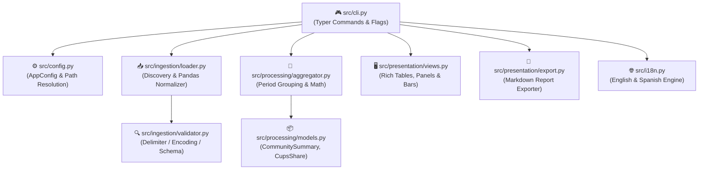

# 🤖 AGENTS.md — Development & Agent Guidelines

> *"Operating manual for autonomous AI coding agents and human contributors working on `datadis-analyzer`. Follow domain invariants, respect neighbor privacy, and write clean, modern Python."*

[](AGENTS.md)
[](https://astral.sh/ruff)
[](https://pre-commit.com/)
[](CONTRIBUTING.md)

---

## 1. 🎯 Project Mission & Core Capabilities

`datadis-analyzer` is a modular, high-performance Python CLI tool (`da`) designed to analyze hourly electrical energy consumption data exported from Spain's [DATADIS](https://datadis.es) platform for residential building communities (*comunidades de vecinos*).

### ⚡ Core Capabilities
- **Robust Ingestion:** Ingest and validate DATADIS CSV export files organized by year in `./.input/<year>/`.
- **Dialect Auto-Detection:** Automatically detect delimiters (`;`, `,`), character encodings (`utf-8`, `latin-1`), and decimal notations (`0,152` vs `0.152`).
- **Community Aggregation:** Aggregate community energy consumption across all individual CUPS (*Código Unificado de Punto de Suministro*).
- **Exact Fair-Share Math:** Calculate each CUPS's percentage share of the total community consumption for each year and month (guaranteed $100.00\%$ sum).
- **Rich Terminal UI:** Render interactive tables, metric cards, inline percentage bars, and analytical alerts using `rich`.
- **Persistent Preferences:** Persist user configuration (output language between English and Spanish) and initialize workspace directories (`.input`, `.output`) via `da init`.
- **Automated Reporting:** Automatically export every generated community summary to `.output/` as a timestamped Markdown report (`YYYYMMDD_HHMMSS_*.md`).

---

## 2. 🧩 Architecture & Component Boundaries



### File Hierarchy
```text
datadis-analyzer/
├── pyproject.toml              # Build config, CLI entry point (da = "src.cli:main"), Ruff config
├── requirements.txt            # Core and test dependency manifest
├── README.md                   # User guide and visual overview
├── AGENTS.md                   # Agent and developer directives
├── CONTRIBUTING.md             # Contribution guidelines & Conventional Commits specification
├── .pre-commit-config.yaml     # Git hook definitions (Ruff linter & formatter)
├── .da_config.json             # Persistent application configuration (language, paths)
├── .input/                     # Annualized raw CSV files (.input/<year>/*.csv)
├── .output/                    # Target directory for generated reports/exports
├── src/
│   ├── __init__.py             # Package marker and version (__version__ = "0.1.0")
│   ├── cli.py                  # Typer CLI application, subcommands (init, summary, help), and flags
│   ├── config.py               # Constants, column definitions, AppConfig, and persistence helpers
│   ├── i18n.py                 # Multi-language translation engine (English & Spanish)
│   ├── ingestion/
│   │   ├── __init__.py
│   │   ├── schema.py           # Dataclasses (ValidationResult) and custom exceptions
│   │   ├── validator.py        # Delimiter/encoding detector and schema validator
│   │   └── loader.py           # File discovery and pandas DataFrame normalizer
│   ├── processing/
│   │   ├── __init__.py
│   │   ├── models.py           # Domain models: CupsShare, PeriodSummary, CommunitySummary
│   │   └── aggregator.py       # Aggregation engine, monthly/annual grouping, and share math
│   └── presentation/
│       ├── __init__.py
│       ├── console.py          # Rich console instance, themes, and visual bar formatters
│       ├── views.py            # Formatted tables, overview panels, help view, and insight cards
│       └── export.py           # Markdown report exporter into .output/
└── tests/
    ├── __init__.py
    ├── conftest.py             # Reusable mock datasets and temporary directory fixtures
    ├── test_validator.py       # Format and schema validation tests
    ├── test_loader.py          # Ingestion, normalization, and DataFrame parsing tests
    ├── test_aggregator.py      # Period grouping, share calculations (100% sum), and pivots
    ├── test_cli.py             # Typer CliRunner integration tests for commands and options
    └── test_config_and_export.py # Config persistence, language switching, and markdown export tests
```

---

## 3. 🛠️ Technology Stack & Standards

- **Runtime:** Python 3.11+ (modern Python syntax, union types `X | Y`)
- **CLI Framework:** [Typer](https://typer.tiangolo.com/) (type-annotated, Click-compatible)
- **Terminal UI & Tables:** [Rich](https://rich.readthedocs.io/)
- **Linter & Formatter:** [Ruff](https://astral.sh/ruff) (Python Prettier)
- **Pre-commit Automation:** [pre-commit](https://pre-commit.com/)
- **Data Manipulation:** [Pandas](https://pandas.pydata.org/)
- **Test Runner:** [Pytest](https://docs.pytest.org/)

---

## 4. 🎮 Workflows & Terminal Commands

### Virtual Environment Setup
```bash
python3 -m venv .venv
source .venv/bin/activate
pip install --upgrade pip
pip install -e ".[dev]"
pre-commit install
```

### Running the CLI
```bash
# Initialize workspace directories (.input, .output) and persist language preference
da init
da init --language es
da init -l en

# Display help and reference manual
da help
da --help

# Default community summary (annual + monthly overview + export to .output/)
da summary

# Filter by year
da summary --year 2025

# Show detailed month-by-month CUPS breakdown
da summary --view monthly

# Inspect single CUPS trajectory
da summary --cups ES0021000000000001AA

# Custom input directory
da summary --input-dir /path/to/input
```

### Running Tests & Quality Checks
```bash
# Run all automated tests
pytest -v

# Run with concise summary
pytest -q

# Run Ruff linter and code formatter
ruff check .
ruff format --check .

# Auto-fix lint and reformat
ruff check --fix .
ruff format .

# Verify git pre-commit hooks across all files
pre-commit run --all-files
```

---

## 5. 📐 Domain Invariants & Data Assumptions

1. **Annualized Folder Layout:** Input CSV files reside in `./.input/<year>/` (e.g., `./.input/2025/`, `./.input/2026/`).
2. **Community Scope:** All CUPS across these files are assumed to belong to the same residential building community (*comunidad de vecinos*).
3. **DATADIS CSV Format:**
   - Standard columns: `cups`, `fecha`, `hora`, `consumo_kWh` (optional: `metodoObtencion`, `energiaVertida_kWh`, `energiaGenerada_kWh`, `energiaAutoconsumida_kWh`).
   - Delimiter is typically `;` (Spanish Excel standard) or `,`.
   - Decimal separator is typically `,` (e.g., `"0,152"`) or `.`.
   - Hours range from `01:00` to `24:00` (24 hourly intervals per day).
4. **Calculations & Share Invariant:**
   - Percentage share for CUPS $i$ in a given period $T$:
     $$\text{Share}_i = \frac{\sum_{t \in T} \text{kWh}_{i, t}}{\sum_{j} \sum_{t \in T} \text{kWh}_{j, t}} \times 100$$
   - **The 100.00% Share Invariant:** The sum of shares across all community CUPS for any period must equal $100.00\%$. Energy can neither be created nor destroyed, and percentage shares must not drift.
5. **Special CUPS Classification:**
   - Dominant consumer (>30%–80% of total): typically community HVAC/pumps/collective services (marked with `★`).
   - Inactive / vacant supply points (<1 kWh): marked with `(0)`.

---

## 6. 🤖 Directives for Autonomous AI Agents

- **🛡️ Directive 1: Anonymization is Absolute.** Never commit or log real DATADIS CUPS, contract numbers, or real residential datasets. Use synthetic mock identifiers (`ES0021000000000001AA`, `ES0021000000000002BB`).
- **🌐 Directive 2: Universal English Codebase.** Write all code, comments, docstrings, test names, CLI messages, and commit messages entirely in **English**.
- **🎯 Directive 3: Strict Modern Typing.** Use strict type hints (`typing`, native union syntax `X | Y`) on all function signatures, dataclasses, and class methods. No unannotated functions or bare `Any`.
- **🚨 Directive 4: Domain Exceptions.** Use custom domain exceptions from `src.ingestion.schema` (`DatadisError`, `DatadisValidationError`, `DatadisParseError`). Handle missing files, wrong headers, and corrupted rows gracefully without dumping raw stack traces.
- **🖥️ Directive 5: The 80-Column Terminal Rule.** Rich tables must render cleanly on standard **80-column terminals**. Keep numeric columns, shares, and CUPS identifiers wrapped in `no_wrap=True`.
- **🧪 Directive 6: Test Completeness.** Any new calculation logic, CLI flag, or validation rule must include automated unit tests in `tests/`. Always run `pytest` before finalizing tasks.
- **🧹 Directive 7: Ruff & Pre-Commit Adherence.** Run `ruff check --fix .` and `ruff format .` before committing changes. Git pre-commit hooks will automatically reject non-compliant commits.
- **📝 Directive 8: Conventional Commits.** Adhere strictly to the Conventional Commits specification documented in [CONTRIBUTING.md](CONTRIBUTING.md).

---

## 7. 📚 Related Documentation

- 📖 [README.md](README.md) — User setup, command reference, and visual overview.
- 🤝 [CONTRIBUTING.md](CONTRIBUTING.md) — Open-source contribution guidelines, coding standards, and PR workflows.
