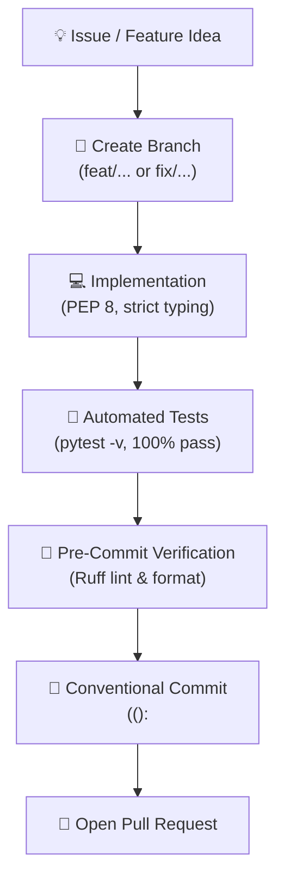

# 🤝 Contributing to DATADIS Analyzer

> Contribution guidelines, code standards, and workflow instructions for DATADIS Analyzer (`da`).

[](https://conventionalcommits.org)
[](https://astral.sh/ruff)
[](https://pre-commit.com/)
[](https://docs.pytest.org/)

We welcome contributions to **DATADIS Analyzer** (`da`). Please follow these guidelines to maintain code quality, data privacy, and consistent collaboration across the project.

---

## 🗺️ Contribution Lifecycle



---

## 📋 Table of Contents
1. [🛡️ Privacy & Anonymization Policy](#1-privacy--anonymization-policy)
2. [🛠️ Development Environment Setup](#2-development-environment-setup)
3. [📝 Conventional Commits Specification](#3-conventional-commits-specification)
4. [🎯 Coding Standards & Tooling](#4-coding-standards--tooling)
5. [🧪 Testing Guidelines](#5-testing-guidelines)
6. [🚀 Pull Request Workflow & Checklist](#6-pull-request-workflow--checklist)
7. [📚 Related Documentation](#7-related-documentation)

---

## 1. 🛡️ Privacy & Anonymization Policy

DATADIS export files contain private household information (supply point locations, consumption routines, and contract references).

> [!CAUTION]
> **Never commit real CUPS numbers, contract references, or household datasets to version control.**

- Test fixtures in `tests/conftest.py` and mock CSV files must use synthetic identifiers conforming to Spain's format:
  - `ES0021000000000001AA`
  - `ES0021000000000002BB`
- Any commit, issue, or pull request containing real supply point data will be purged immediately.

---

## 2. 🛠️ Development Environment Setup

### Prerequisites
- **Python:** 3.11+ (Python 3.12 and 3.14 supported)
- **Git:** 2.30+

### Setup Commands
```bash
# 1. Clone repository and create virtual environment
git clone git@github.com:marcosDLCS/datadis-analyzer.git
cd datadis-analyzer
python3 -m venv .venv
source .venv/bin/activate

# 2. Install dependencies and CLI in editable mode
pip install --upgrade pip
pip install -e ".[dev]"

# 3. Install git pre-commit hooks (runs Ruff on every commit)
pre-commit install

# 4. Verify installation and initialize workspace
da --help
pytest -q
da init
```

---

## 3. 📝 Conventional Commits Specification

All commit messages must adhere to the [Conventional Commits v1.0.0](https://www.conventionalcommits.org/en/v1.0.0/) specification:

```text
<type>(<optional scope>): <description>

[optional body]

[optional footer(s)]
```

### Commit Types
| Type | Purpose | Example |
| :--- | :--- | :--- |
| `feat` | A new user-facing capability | `feat(cli): add quarterly summary flag` |
| `fix` | A bug fix | `fix(validator): handle empty trailing newline` |
| `docs` | Documentation additions or updates | `docs: update contributing visual guide` |
| `style` | Formatting, whitespace, no functional change | `style(views): adjust header padding` |
| `refactor` | Restructuring code without changing behavior | `refactor(aggregator): optimize monthly pivot` |
| `perf` | Measurable performance optimization | `perf(loader): vectorize date parsing` |
| `test` | Adding or improving tests | `test(aggregator): add test for zero consumption` |
| `build` | Packaging or dependency updates | `build: upgrade ruff to 0.9.10` |
| `ci` | Continuous integration workflows | `ci: add matrix test workflow` |
| `chore` | Maintenance tasks | `chore: update gitignore patterns` |

**Recognized scopes:** `cli`, `config`, `core`, `i18n`, `loader`, `validator`, `aggregator`, `views`, `export`, `tooling`.

---

## 4. 🎯 Coding Standards & Tooling

- **🌐 Language & Localization:** Write all code, docstrings, comments, and commit messages in English. All CLI and report text must use `t("key", lang=...)` in [src/i18n.py](src/i18n.py) with translations for both English (`en`) and Spanish (`es`).
- **🏷️ Strict Typing:** Annotate all function signatures with modern type hints (e.g., `int | None`). Avoid bare `Any`.
- **🧹 Linting & Formatting:** Code formatting and linting are enforced via Ruff:
  ```bash
  ruff check --fix .
  ruff format .
  pre-commit run --all-files
  ```
- **🖥️ 80-Column Terminal Rule:** Rich tables and panels must render cleanly within 80-column terminals. Set `no_wrap=True` on numerical, percentage, and CUPS columns.

---

## 5. 🧪 Testing Guidelines

All submissions require automated test coverage.

```bash
pytest -v                            # Verbose test suite execution
pytest -q                            # Concise summary
pytest tests/test_aggregator.py -v   # Single test file
```

### Core Invariants
1. **The 100.00% Share Invariant:** For any period, the sum of `share_pct` across all community supply points must equal `100.00%`.
2. **Test Isolation:** Tests must not modify user configuration or production directories. Use `tmp_path` and `reset_default_config` fixtures.

---

## 6. 🚀 Pull Request Workflow & Checklist

1. **Branch Naming:** Create a feature or bugfix branch (`feat/<name>` or `fix/<name>`).
2. **Local Validation:** Ensure tests and pre-commit checks pass prior to opening a PR:
   ```bash
   pytest -v
   ruff check .
   ruff format --check .
   pre-commit run --all-files
   ```
3. **Atomic Commits:** Follow the Conventional Commits specification.

### PR Checklist
- [ ] Commits adhere to Conventional Commits format (`<type>(<scope>): <desc>`).
- [ ] All automated tests pass (`pytest -v`).
- [ ] Ruff linting and formatting checks succeed.
- [ ] Pre-commit hooks pass across all files (`pre-commit run --all-files`).
- [ ] No real CUPS identifiers or sensitive data are included.
- [ ] Translations updated in `src/i18n.py` (`en` and `es`) if UI text was modified.
- [ ] Relevant documentation updated (`README.md`, `AGENTS.md`).
- [ ] Submission complies with the [MIT License](LICENSE).

---

## 7. 📚 Related Documentation

- 📖 [README.md](README.md) — User setup, command options, and architecture overview.
- 🤖 [AGENTS.md](AGENTS.md) — Technical instructions and architectural guidelines for AI agents and developers.
- 📄 [LICENSE](LICENSE) — MIT open-source license terms.
