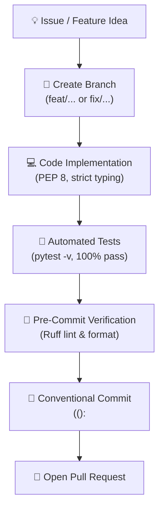

# 🤝 Contributing to DATADIS Analyzer

> *"Leave the code better than you found it, format with Ruff, and never, ever leak a neighbor's real CUPS."*

[](https://conventionalcommits.org)
[](https://astral.sh/ruff)
[](https://pre-commit.com/)
[](https://docs.pytest.org/)

Thank you for your interest in contributing to **DATADIS Analyzer** (`da`)! This project is an open-source CLI utility and analytical engine designed to bring transparency and mathematical harmony to residential building energy distribution in Spain.

We welcome all contributors: from first-time issue filers to seasoned Python data engineers.

---

## 🗺️ Contribution Lifecycle



---

## 📋 Table of Contents
1. [🛡️ Privacy First: Anonymization Policy](#1-privacy-first-anonymization-policy)
2. [🛠️ Development Environment Setup](#2-development-environment-setup)
3. [📝 Conventional Commits Specification](#3-conventional-commits-specification)
4. [🎯 Coding Standards & Tooling](#4-coding-standards--tooling)
5. [🧪 Testing Guidelines](#5-testing-guidelines)
6. [🚀 Pull Request Workflow & Checklist](#6-pull-request-workflow--checklist)
7. [📚 Related Documentation](#7-related-documentation)

---

## 1. 🛡️ Privacy First: Anonymization Policy

### ⚠️ The Golden Rule: Zero Real Data in Git
DATADIS exports from electricity distributors contain sensitive private data:
- **CUPS identifiers** pinpoint specific physical residences.
- **Hourly consumption timelines** reveal when families sleep, cook, or leave on vacation.
- **Contract references** are legally protected personal identifiers.

> [!CAUTION]
> **NEVER commit real CUPS numbers, contract IDs, or real household datasets into this repository.**

- All test fixtures in `tests/conftest.py` and mock CSV files must use **dummy test CUPS** matching Spain's format:
  - `ES0021000000000001AA`
  - `ES0021000000000002BB`
- Any commit, issue, or pull request containing real supply point data will be purged immediately.

---

## 2. 🛠️ Development Environment Setup

### Prerequisites
- **Python:** 3.11+ (Python 3.12 or 3.14 supported).
- **Git:** 2.30+.

### Step-by-Step Local Setup

1. **Clone the repository:**
   ```bash
   git clone git@github.com:marcosDLCS/datadis-analyzer.git
   cd datadis-analyzer
   ```

2. **Create and activate a virtual environment:**
   ```bash
   python3 -m venv .venv
   source .venv/bin/activate
   ```

3. **Install dependencies and CLI in editable mode:**
   ```bash
   pip install --upgrade pip
   pip install -e ".[dev]"
   ```

4. **Install Git Pre-commit Hooks (Mandatory):**
   ```bash
   pre-commit install
   ```
   > [!TIP]
   > This single command hooks into git so that every `git commit` automatically triggers **Ruff** linting and formatting. You will never commit broken code or misaligned indents!

5. **Verify the environment:**
   ```bash
   da --help
   pytest
   ruff check .
   ruff format --check .
   ```

6. **Initialize local workspace directories:**
   ```bash
   da init
   ```

---

## 3. 📝 Conventional Commits Specification

We adhere strictly to the [Conventional Commits v1.0.0](https://www.conventionalcommits.org/en/v1.0.0/) specification. This ensures automated changelog generation, clean git graphs, and clear project intent.

```text
<type>(<optional scope>): <description>

[optional body explaining 'why' and 'what']

[optional footer(s)]
```

### Commit Types Cheat Sheet
| Type | Purpose | Example |
| :--- | :--- | :--- |
| `feat` | A new user-facing capability | `feat(cli): add quarterly summary flag` |
| `fix` | A bug fix | `fix(validator): handle empty trailing newline` |
| `docs` | Documentation additions or updates | `docs: add contributing visual guide` |
| `style` | Formatting, whitespace, no functional change | `style(views): adjust header padding` |
| `refactor` | Code restructuring with identical behavior | `refactor(aggregator): optimize monthly pivot logic` |
| `perf` | Measurable performance optimization | `perf(loader): vectorize date parsing` |
| `test` | Adding or improving tests | `test(aggregator): add test for zero-consumption CUPS` |
| `build` | Packaging, build system, pyproject.toml | `build: upgrade ruff to 0.9.10` |
| `ci` | Continuous integration workflows | `ci: add GitHub Actions matrix test` |
| `chore` | Housekeeping, gitignore updates | `chore: update editor ignore patterns` |

### Recognized Scopes
- `cli` — Typer commands, options, prompts (`src/cli.py`)
- `core` — Core application infrastructure
- `config` — Settings, defaults, path resolution (`src/config.py`)
- `i18n` — Localization and translations (`src/i18n.py`)
- `loader` — CSV file discovery and loading (`src/ingestion/loader.py`)
- `validator` — Delimiter/encoding/schema validator (`src/ingestion/validator.py`)
- `aggregator` — Grouping math and share calculations (`src/processing/aggregator.py`)
- `views` — Rich tables, progress bars, panels (`src/presentation/views.py`)
- `export` — Markdown file generation (`src/presentation/export.py`)
- `tooling` — Ruff, pre-commit, formatting configurations

---

## 4. 🎯 Coding Standards & Tooling

### Language & Internationalization
- **English Everywhere:** Write all code, class names, functions, docstrings, variable names, and comments in **English**.
- **User Interface (i18n):** Any string shown in the CLI or printed in Markdown reports must use the translation helper `t("key", lang=...)` with entries in [src/i18n.py](src/i18n.py) for both English (`en`) and Spanish (`es`).

### Python Typing
- Strict type hinting is required on **all** public and private functions.
- Use native modern union syntax: `int | None` instead of `Optional[int]`.
- Avoid untyped `Any` whenever a dataclass or structured type can be defined.

### 🧹 Linting & Formatting (Ruff: Python's Prettier)
We let robots handle formatting so humans can focus on architecture:
- **Linter:** `ruff check .` (auto-fix with `ruff check --fix .`).
- **Formatter:** `ruff format .` (verify with `ruff format --check .`).
- **Hook check:** Test all hooks across files with `pre-commit run --all-files`.

### Terminal Aesthetics (The 80-Column Rule)
- All Rich tables and panels must render cleanly within standard **80-column terminal windows**.
- Always use `no_wrap=True` for numerical data, percentage columns, and CUPS IDs to avoid unsightly text wrapping.

---

## 5. 🧪 Testing Guidelines

No code merges without automated test coverage.

### Running Pytest
```bash
# Verbose execution with full test names
pytest -v

# Quick summary
pytest -q

# Run an individual test file
pytest tests/test_aggregator.py -v
```

### Invariants Every Test Must Uphold
1. **The 100.00% Share Invariant:** For any period (annual or monthly), the sum of `share_pct` across all community supply points must equal `100.00%` (within floating point precision).
2. **Isolation:** Tests must never touch the user's real `.da_config.json` or `.output/` directories. Use the `reset_default_config` fixture and `tmp_path`.

---

## 6. 🚀 Pull Request Workflow & Checklist

1. **Create your feature branch:**
   ```bash
   git checkout -b feat/your-descriptive-feature-name
   ```

2. **Develop with confidence:**
   - Keep changes focused and atomic.
   - Add unit tests in `tests/` for every new branch or calculation.

3. **Verify locally before pushing:**
   ```bash
   # 1. Run automated tests
   pytest -v

   # 2. Run linter and formatter
   ruff check .
   ruff format --check .

   # 3. Verify all pre-commit hooks
   pre-commit run --all-files
   ```

4. **Commit with Conventional Commits:**
   ```bash
   git commit -m "feat(views): add quarterly breakdown comparison table"
   ```

5. **PR Checklist:**
   - [ ] Commits strictly follow Conventional Commits (`<type>(<scope>): <desc>`).
   - [ ] All 35+ automated tests pass (`pytest -v`).
   - [ ] Code is formatted with Ruff (`ruff format --check .`).
   - [ ] Pre-commit hooks pass (`pre-commit run --all-files`).
   - [ ] No real CUPS identifiers or sensitive data are included.
   - [ ] Translations updated in `src/i18n.py` (both `en` and `es`) if UI text changed.
   - [ ] Documentation (`README.md`, `AGENTS.md`) updated where appropriate.
   - [ ] Contributions are submitted under the terms of the [MIT License](LICENSE).

---

## 7. 📚 Related Documentation

- 📖 [README.md](README.md) — Comprehensive user setup, command options, and architecture overview.
- 🤖 [AGENTS.md](AGENTS.md) — Detailed specifications, technical guidelines, and domain invariants for AI coding assistants.
- 📄 [LICENSE](LICENSE) — Standard MIT open-source license terms.
