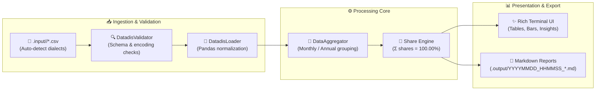

# ⚡ DATADIS Analyzer (`da`)

> Energy analytics and fair-share allocation CLI for residential communities (*comunidades de vecinos*) in Spain.

[](https://www.python.org/)
[](https://typer.tiangolo.com/)
[](https://rich.readthedocs.io/)
[](https://astral.sh/ruff)
[](https://pre-commit.com/)
[](https://opensource.org/licenses/MIT)

---

## 🚀 Key Capabilities

- **🔍 Multi-Dialect CSV Ingestion:** Automatically detects delimiters (`;`, `,`, `\t`), decimal notations (`0,152` vs `0.152`), character encodings (`utf-8`, `utf-8-sig`, `latin-1`, `cp1252`), and date formats (`YYYY/MM/DD`, `YYYY-MM-DD`).
- **🧮 Exact Fair-Share Math:** Calculates each supply point's (CUPS) percentage share of collective community consumption across months and years, guaranteed to sum to exactly 100.00%.
- **📊 Rich Terminal Visualizations:** Renders interactive tables, metric overview cards, inline percentage bars (`████████░░`), and alerts for dominant (`★`) or inactive (`(0)`) meters.
- **🌐 Dual-Language Support:** Full English (`en`) and Spanish (`es`) localization, persisted across commands via `.da_config.json`.
- **📝 Automated Markdown Reporting:** Exports timestamped reports directly into `.output/YYYYMMDD_HHMMSS_*.md`.

---

## 🏗️ Architecture & Data Flow



---

## 🖥️ Terminal Output Preview

```text
╭──────────────── ⚡ DATADIS RESIDENTIAL COMMUNITY ENERGY SUMMARY ────────────────╮
│  Supply Points (CUPS): 8         Date Range: 2025-01-01 ➔ 2025-12-31             │
│  Total Meter Readings: 70,080    Total Community Energy: 18,450.25 kWh           │
╰──────────────────────────────────────────────────────────────────────────────────╯

╭───────────── 📅 Annual Consumption & Shares: 2025 (Total: 9,250.00 kWh) ─────────────╮
│ Rank │ CUPS                   │  Consumption │   Share │ Distribution                │
│──────┼────────────────────────┼──────────────┼─────────┼─────────────────────────────│
│    1 │ ES0021000000000001AA ★ │ 4,625.00 kWh │  50.00% │ ██████░░░░░░                │
│    2 │ ES0021000000000002BB   │ 2,312.50 kWh │  25.00% │ ███░░░░░░░░░                │
│    3 │ ES0021000000000003CC   │ 1,850.00 kWh │  20.00% │ ██░░░░░░░░░░                │
│    4 │ ES0021000000000004DD   │   462.50 kWh │   5.00% │ █░░░░░░░░░░░                │
│    5 │ ES0021000000000005EE   │     0.00 kWh │   0.00% │ ░░░░░░░░░░░░                │
│──────┼────────────────────────┼──────────────┼─────────┼─────────────────────────────│
│      │ Total                  │ 9,250.00 kWh │ 100.00% │                             │
╰──────────────────────────────────────────────────────────────────────────────────────╯
Legend: ★ Dominant Consumer (>30% of total)  |  (0) Inactive supply (<1 kWh)
```

---

## 📁 Repository Layout

```text
datadis-analyzer/
├── pyproject.toml              # Build config, dependencies, and CLI entry point (da)
├── requirements.txt            # Package dependencies manifest
├── LICENSE                     # Standard MIT license
├── README.md                   # User documentation and guide
├── AGENTS.md                   # Agent and technical developer directives
├── CONTRIBUTING.md             # Contribution guidelines & Conventional Commits
├── .pre-commit-config.yaml     # Pre-commit hook definitions (Ruff linter & formatter)
├── .da_config.json             # Persistent application configuration
├── .input/                     # Annualized raw CSV files (.input/<year>/*.csv)
├── .output/                    # Auto-generated markdown reports & archives
├── src/
│   ├── cli.py                  # Typer CLI application and command handlers
│   ├── config.py               # Constants, column definitions, and path helpers
│   ├── i18n.py                 # Multi-language translation engine (en/es)
│   ├── ingestion/              # Delimiter detection, validation, and Pandas loader
│   ├── processing/             # Aggregation engine, domain models, and share math
│   └── presentation/           # Rich console UI, views, and Markdown exporter
└── tests/                      # Automated unit, integration, and CLI test suite
```

---

## 📦 Installation & Setup

```bash
# 1. Clone repository & create virtual environment
git clone git@github.com:marcosDLCS/datadis-analyzer.git
cd datadis-analyzer
python3 -m venv .venv
source .venv/bin/activate

# 2. Install dependencies with development tools
pip install --upgrade pip
pip install -e ".[dev]"

# 3. Install git pre-commit hooks
pre-commit install

# 4. Initialize workspace directories (.input, .output) and set language
da init
```

---

## 📂 Input Data Conventions

Place DATADIS CSV files into annualized subdirectories inside `./.input/<year>/`:

```text
.input/
  ├── 2025/
  │   ├── ES0021000000000001AA_Consumo_01-01-2025_31-12-2025.csv
  │   └── ES0021000000000002BB_Consumo_01-01-2025_31-12-2025.csv
  └── 2026/
      └── ...
```

> [!IMPORTANT]
> **Data Privacy:** DATADIS exports contain private household data. Never commit real CUPS files to version control. The `./.input/` directory is ignored by git for privacy.

Required columns (semicolon or comma delimited):
| Column | Description | Example |
| :--- | :--- | :--- |
| `cups` | Universal Supply Point Code | `"ES0021000000000001AA"` |
| `fecha` | Reading date | `"2025/01/15"` |
| `hora` | Hour interval (`01:00` to `24:00`) | `"14:00"` |
| `consumo_kWh` | Interval energy consumption | `"0,152"` or `"0.152"` |

---

## 🎮 CLI Usage Manual

### ⚙️ Workspace Configuration (`da init`)
```bash
da init                 # Interactive language selection
da init --language es   # Set language to Spanish
da init -l en           # Set language to English
```

### 📖 Help & Manual (`da help`)
```bash
da help                 # Display interactive reference manual
da help --lang es       # Display help in Spanish
```

### 📊 Community Summary (`da summary`)
```bash
da summary              # Annual & monthly community overview + markdown export
da summary --year 2025  # Filter to a specific year
da summary --view monthly # Full month-by-month CUPS breakdown table
da summary --cups ES0021000000000001AA # Dedicated CUPS trajectory
da summary --input-dir /path/to/input   # Custom input directory
```

### 🔄 Multi-Year Comparison (`da compare`)
```bash
da compare              # Compare all years in ./.input/, auto-generate bar charts & export report
da compare -y 2024 -y 2025  # Compare specific years
da compare --years 2024,2025 # Comma-separated year selection
da compare --no-charts  # Skip PNG bar chart generation
da compare --lang es    # Render comparison in Spanish
```
- **Incomplete Month Handling:** Automatically detects incomplete or missing months. Incomplete months display "No data" and are excluded from delta and trend calculations for honest, apples-to-apples comparisons.
- **Visual Bar Charts:** Generates high-resolution grouped bar charts for every CUPS (X: Month, Y: Consumption kWh, one bar per year) and embeds them directly into the generated Markdown report.

### 🧹 Output Cleanup (`da cleanup` / `da clean`)
```bash
da cleanup              # Interactive cleanup (prompts before deletion)
da cleanup --force      # Immediate deletion without confirmation
da clean -f             # Short alias
da cleanup --output-dir /path/to/output -f # Clean custom output directory
```

---

## 🧪 Quality Assurance & Tooling

```bash
# Run test suite (59 automated tests)
pytest -v

# Run Ruff linter and code formatter
ruff check --fix .
ruff format .

# Verify pre-commit hooks across all files
pre-commit run --all-files
```

---

## 🤝 Contributing & License

Contributions are welcome. Please consult:
- 📘 [CONTRIBUTING.md](CONTRIBUTING.md) — Coding conventions, Conventional Commits specification, and PR workflow.
- 🤖 [AGENTS.md](AGENTS.md) — Technical instructions and architectural guidelines for AI agents and developers.

This project is licensed under the [MIT License](LICENSE).

---

## 🤖 AI Development & Vibe Coding Disclosure

This project was developed using a **vibe coding** workflow, pairing natural language direction with agentic code generation and automated quality verification:

- **🛠️ Agentic IDE:** Google Antigravity IDE (Advanced Agentic Coding environment by Google DeepMind).
- **🧠 Models:** Google Gemini (Gemini Flash 3.8 in High reasoning).
- **🛡️ Governance & Quality Assurance:**
  - Automated validation with several unit, integration, and CLI tests via **Pytest**.
  - Strict pre-commit enforcement with **Ruff** for linting and code formatting.
  - Domain invariant guarantees (100.00% fair-share mathematical sum).
  - Absolute anonymization protocols for residential energy data.
