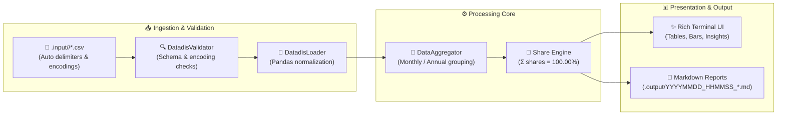

# ⚡ DATADIS Analyzer (`da`)

> *Bringing mathematical clarity, transparency, and peace of mind to residential community energy management.*
> *(Because no building meeting (*junta de propietarios*) should ever descend into chaos over who ran the heat pump.)*

[](https://www.python.org/)
[](https://typer.tiangolo.com/)
[](https://rich.readthedocs.io/)
[](https://astral.sh/ruff)
[](https://pre-commit.com/)
[](https://opensource.org/licenses/MIT)

---

## 🌟 What is DATADIS Analyzer?

`datadis-analyzer` is a modern, modular Python command-line application (`da`) designed to ingest, validate, aggregate, and visualize hourly electrical consumption data exported from Spain's national [DATADIS](https://datadis.es) platform for residential communities (*comunidades de vecinos*).

Whether your building has collective geothermal pumps, shared aerothermal systems, common lighting, or 40 individual apartments, `da` computes each supply point's exact fair-share contribution down to two decimal places.

---

## 🚀 Key Capabilities

- **🔍 Auto-Detecting Ingestion Engine:** Transparently handles Spanish CSV exports:
  - Delimiters: `;`, `,`, or `\t`
  - Decimal formats: Spanish comma `0,152` vs English dot `0.152`
  - Encodings: `utf-8`, `utf-8-sig`, `latin-1`, and `cp1252`
- **🧮 100.00% Share Invariant:** Calculates the exact mathematical share of collective consumption for every individual CUPS (*Código Unificado de Punto de Suministro*), ensuring period totals always sum to exactly 100.00%.
- **📊 Rich Terminal Visualizations:** Displays colorized metrics cards, interactive tables, inline ASCII percentage bars (`████████░░`), and analytical alerts for dominant (`★`) and inactive (`(0)`) meters.
- **🌐 Dual-Language Support:** First-class internationalization in both **English** (`en`) and **Spanish** (`es`), selectable interactively or via flags and persisted across sessions.
- **📝 Automated Markdown Reports:** Every summary generation automatically archives a clean, dated report into `.output/YYYYMMDD_HHMMSS_community_summary.md`.

---

## 🏗️ System Architecture & Data Flow



---

## 🖥️ Terminal Experience Preview

Here is a glimpse of what `da summary` renders in your terminal:

```text
╭──────────────── ⚡ DATADIS RESIDENTIAL COMMUNITY ENERGY SUMMARY ────────────────╮
│  Supply Points (CUPS): 8         Date Range: 2025-01-01 ➔ 2025-12-31             │
│  Total Meter Readings: 70,080    Total Community Energy: 18,450.25 kWh           │
╰──────────────────────────────────────────────────────────────────────────────────╯

╭───────────── 📅 Annual Consumption & Shares: 2025 (Total: 9,250.00 kWh) ─────────────╮
│ Rank │ CUPS                   │  Consumption │   Share │ Distribution                │
│──────┼────────────────────────┼──────────────┼─────────┼─────────────────────────────│
│    1 │ ES0021000000000001AA ★ │ 4,625.00 kWh │  50.00% │ ██████░░░░░░                │
│    2 │ ES0021000000000002BB   │ 2,312.50 kWh │  25.00% │ ███░░░░░░░░░                │
│    3 │ ES0021000000000003CC   │ 1,850.00 kWh │  20.00% │ ██░░░░░░░░░░                │
│    4 │ ES0021000000000004DD   │   462.50 kWh │   5.00% │ █░░░░░░░░░░░                │
│    5 │ ES0021000000000005EE   │     0.00 kWh │   0.00% │ ░░░░░░░░░░░░                │
│──────┼────────────────────────┼──────────────┼─────────┼─────────────────────────────│
│      │ Total                  │ 9,250.00 kWh │ 100.00% │                             │
╰──────────────────────────────────────────────────────────────────────────────────────╯
Legend: ★ Dominant Consumer (>30% of total)  |  (0) Inactive supply (<1 kWh)
```

---

## 📁 Repository Layout

```text
datadis-analyzer/
├── pyproject.toml              # Build metadata, dependencies, and CLI script entrypoint (`da`)
├── requirements.txt            # Core, dev, and test dependency manifest
├── README.md                   # User documentation and visual guide
├── AGENTS.md                   # Technical reference and AI agent guidelines
├── CONTRIBUTING.md             # Contribution workflow & Conventional Commits specification
├── .pre-commit-config.yaml     # Pre-commit hook configuration (Ruff linter & formatter)
├── .da_config.json             # Persistent application configuration (language, paths)
├── .input/                     # Annualized DATADIS CSV export directories
│   ├── 2024/
│   ├── 2025/
│   └── 2026/
├── .output/                    # Auto-generated markdown reports & export archives
├── src/
│   ├── __init__.py             # Package marker and version
│   ├── cli.py                  # Typer CLI application, subcommands, and options
│   ├── config.py               # Constants, column schemas, and path helpers
│   ├── i18n.py                 # Multi-language translation engine (English & Spanish)
│   ├── ingestion/
│   │   ├── __init__.py
│   │   ├── schema.py           # Dataclass models for validation results and exceptions
│   │   ├── validator.py        # Delimiter/encoding detector and schema validator
│   │   └── loader.py           # Directory scanner and pandas DataFrame normalizer
│   ├── processing/
│   │   ├── __init__.py
│   │   ├── models.py           # Typed domain summary containers (CupsShare, CommunitySummary)
│   │   └── aggregator.py       # Aggregation engine, monthly/annual grouping, and share math
│   └── presentation/
│       ├── __init__.py
│       ├── console.py          # Rich console instance, palettes, and visual bar generators
│       ├── views.py            # Formatted tables, overview panels, help, and insights
│       └── export.py           # Markdown report exporter into .output/
└── tests/
    ├── __init__.py
    ├── conftest.py             # Reusable mock datasets and temporary directory fixtures
    ├── test_validator.py       # Encoding, delimiter, and schema validation tests
    ├── test_loader.py          # Discovery, normalization, and DataFrame parsing tests
    ├── test_aggregator.py      # Period grouping, share calculations (100% sum), and pivots
    ├── test_cli.py             # CLI runner integration tests for all commands and options
    └── test_config_and_export.py # Config persistence, language switching, and markdown export tests
```

---

## 📦 Installation & Setup

### 1. Clone & Set Up Virtual Environment

```bash
git clone git@github.com:marcosDLCS/datadis-analyzer.git
cd datadis-analyzer

python3 -m venv .venv
source .venv/bin/activate
```

### 2. Install Package with Development Tools

```bash
pip install --upgrade pip
pip install -e ".[dev]"
```

### 3. Install Git Pre-Commit Hooks

```bash
pre-commit install
```

> [!TIP]
> Installing pre-commit hooks guarantees that **Ruff** will auto-lint and format your code before every commit. No awkward CI failures!

### 4. Initialize Workspace & Language Preference

```bash
da init
```

This interactive command creates the `./.input` and `./.output` directories and persists your preferred language in `.da_config.json`.

---

## 📂 Input Data Conventions

Organize your raw DATADIS CSV downloads inside `./.input/<year>/`:

```text
.input/
  ├── 2025/
  │   ├── ES0021000000000001AA_Consumo_01-01-2025_31-12-2025.csv
  │   ├── ES0021000000000002BB_Consumo_01-01-2025_31-12-2025.csv
  │   └── ...
  └── 2026/
      ├── ES0021000000000001AA_Consumo_01-01-2026_30-09-2026.csv
      └── ...
```

> [!IMPORTANT]
> **Privacy First:** DATADIS exports contain private household data. Never commit real CUPS files to version control. Keep `.input/` for local processing only.

Required columns in DATADIS files (case-insensitive, semicolon or comma delimited):
| Column | Description | Example |
| :--- | :--- | :--- |
| `cups` | Universal Supply Point Code | `"ES0021000000000001AA"` |
| `fecha` | Reading date | `"2025/01/15"` or `"2025-01-15"` |
| `hora` | Hour interval (`01:00` to `24:00`) | `"14:00"` |
| `consumo_kWh` | Energy consumed during interval | `"0,152"` or `"0.152"` |

---

## 🎮 CLI Usage Manual

```text
Usage: da [OPTIONS] COMMAND [ARGS]...
```

### ⚙️ 1. Workspace & Language Init (`da init`)
```bash
# Interactive prompt (English / Spanish):
da init

# Or directly via flag:
da init --language es
da init -l en
```

### 📖 2. Interactive Reference Manual (`da help`)
```bash
da help
# or in Spanish:
da help --lang es
```

### 📊 3. Community Energy Summary (`da summary`)
Calculates community aggregation across all files in `./.input/` and saves a timestamped Markdown report into `./.output/`:

```bash
# Complete summary (annual + monthly overview + insights):
da summary

# Focus on a specific calendar year:
da summary --year 2025

# Show detailed month-by-month CUPS breakdown table:
da summary --view monthly

# Trace the consumption trajectory of an individual CUPS:
da summary --cups ES0021000000000001AA

# Point to an alternate input folder:
da summary --input-dir /path/to/custom_input
```

---

## 🧪 Quality Assurance & Tooling

We keep our codebase clean, fast, and strictly typed:

```bash
# 🧪 Run full automated test suite (35+ tests)
pytest -v

# 🔍 Run Ruff linter checks
ruff check .

# ✨ Auto-fix linting issues
ruff check --fix .

# 🎨 Auto-format code with Python Prettier (Ruff format)
ruff format .

# 🛡️ Run all pre-commit hooks manually
pre-commit run --all-files
```

---

## 🤝 Contributing

Contributions are warmly welcome! Please check out:
- 📘 [CONTRIBUTING.md](CONTRIBUTING.md) — Coding conventions, Conventional Commits guide, and Pull Request workflow.
- 🤖 [AGENTS.md](AGENTS.md) — Technical instructions, architectural standards, and guidelines for AI coding agents.

---

## 📄 License

This project is licensed under the terms of the [MIT License](LICENSE).
