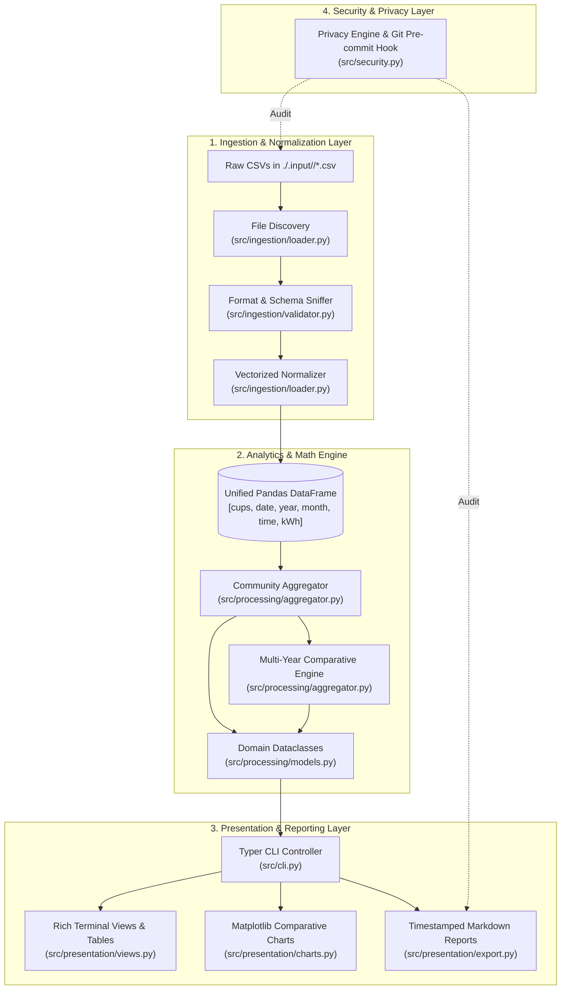

# 📘 DATADIS Analyzer — Technical Architecture & Operational Guide

> A comprehensive, didactical guide to understanding how DATADIS Analyzer (`da`) ingests, validates, processes, and visualizes hourly energy consumption data for residential building communities.

---

> [!IMPORTANT]
> ### 🪢 Documentation Maintenance Harness & Synchronization Directive
> This guide is an authoritative technical reference for developers, system administrators, and autonomous AI agents.
> **Whenever the codebase is modified, you MUST verify and update this documentation if your changes affect:**
> 1. **Ingestion Schemas or File Formats:** Alterations to required columns, encodings, date formats, or directory structures in [`src/config.py`](file:///Users/marcos/workspace/repo/datadis-analyzer/src/config.py) and [`src/ingestion/`](file:///Users/marcos/workspace/repo/datadis-analyzer/src/ingestion/).
> 2. **Processing Math & Invariants:** Updates to the 100.00% fair-share formula, calendar completeness checks, or aggregation logic in [`src/processing/aggregator.py`](file:///Users/marcos/workspace/repo/datadis-analyzer/src/processing/aggregator.py).
> 3. **Classification Heuristics:** Changes to consumer badges (`★` dominant $>30\%$, `(0)` inactive $<1\text{ kWh}$) in [`src/presentation/views.py`](file:///Users/marcos/workspace/repo/datadis-analyzer/src/presentation/views.py).
> 4. **CLI Commands & Flags:** New subcommands, options, or report formats in [`src/cli.py`](file:///Users/marcos/workspace/repo/datadis-analyzer/src/cli.py).
> 5. **Privacy & Security Invariants:** Revisions to approved synthetic mock CUPS patterns or scanner rules in [`src/security.py`](file:///Users/marcos/workspace/repo/datadis-analyzer/src/security.py).

---

## 1. 🎯 Purpose & Core Principles

### What is DATADIS?
In Spain, **DATADIS** ([datadis.es](https://datadis.es)) is the unified digital platform operated by electricity distributors that provides consumers and building managers access to hourly electricity meter data.

### The Residential Community Challenge
In residential buildings (*comunidades de propietarios*), multiple electricity meters exist concurrently:
- Individual private apartments.
- Shared community services (elevators, centralized heat pumps, garage lighting/ventilation, swimming pool pumps, exterior lighting).

Each supply point receives independent hourly CSV exports containing up to **8,760 hourly readings per year**. These exports often have inconsistent delimiters (`;` vs `,`), varying character encodings (`UTF-8` vs `ISO-8859-1`), and localized numeric formats (`0,152` with comma decimals).

`datadis-analyzer` (`da`) eliminates the manual friction of consolidating these disparate CSV files, providing:
1. **Automated Discovery & Ingestion:** Safe parsing of raw CSV exports without manual formatting.
2. **Fair-Share Mathematical Allocation:** Exact percentage breakdowns for every supply point.
3. **Apples-to-Apples Multi-Year Comparisons:** Fair comparison across calendar years that accounts for in-progress or incomplete months.
4. **Rich Terminal Visualizations & Markdown Reports:** Beautiful terminal dashboards and persistent audit summaries.
5. **Absolute Zero-Leakage Privacy:** Strict protection against committing real personal supply point codes (CUPS).

---

## 2. 🏛️ Architectural Overview & Data Lifecycle

The application follows a clean layered pipeline where data flows unidirectionally from raw disk files to normalized DataFrames, structured domain models, and finally to presentation interfaces.

---

## 3. 📥 Data Ingestion Pipeline (How the Tool Gets the Info)

The ingestion pipeline transforms raw, heterogeneous CSV files into a clean, queryable Pandas DataFrame.

### A. Annualized Directory Discovery
- **Default Directory:** Raw CSV files are organized by year in `./.input/<year>/` (e.g., `./.input/2024/*.csv`, `./.input/2025/*.csv`).
- **Discovery Strategy:** [`DatadisLoader.discover_files`](file:///Users/marcos/workspace/repo/datadis-analyzer/src/ingestion/loader.py#L34-L67) scans the specified year directory. If no year filter is supplied, it recursively discovers all CSV files under `./.input/`, skipping hidden and backup files.

### B. Format & Schema Sniffing
Raw files from DATADIS vary depending on which utility company generated the export. [`DatadisValidator`](file:///Users/marcos/workspace/repo/datadis-analyzer/src/ingestion/validator.py#L10-L147) automatically adapts to these variations:
1. **Character Encoding Detection:** Attempts UTF-8 variants (`utf-8`, `utf-8-sig`) by reading a representative byte chunk, falling back gracefully to Latin-1 (`iso-8859-1` / `cp1252`).
2. **Delimiter Detection:** Counts candidate separators (`;`, `,`, `\t`) in header lines, prioritizing the standard Spanish DATADIS semicolon (`;`) and falling back to Python's `csv.Sniffer`.
3. **Mandatory Header Verification:** Enforces that every file contains the four required columns:
   - `cups`: The Supply Point Code.
   - `fecha`: The reading date.
   - `hora`: The hourly period (`01:00` to `24:00`).
   - `consumo_kWh`: Energy consumed in kilowatt-hours.

### C. Vectorized DataFrame Normalization
In [`DatadisLoader.load_file`](file:///Users/marcos/workspace/repo/datadis-analyzer/src/ingestion/loader.py#L69-L150), files are loaded and normalized in memory:
1. **Safe String Ingestion (`dtype=str`):** Loads all columns initially as strings to prevent premature float rounding or parsing crashes.
2. **Header Normalization:** Case-insensitively maps headers (`consumo_kWh`, `consumoKwh`, `CONSUMO_KWH`) to standard internal constants.
3. **European Decimal Parsing:** Replaces comma decimal separators with standard points (`0,152` ➔ `0.152`) and coerces invalid/missing values to `0.0`.
4. **Mixed Datetime Parsing:** Uses `pd.to_datetime(format="mixed")` to seamlessly parse both Spanish standard (`DD/MM/YYYY`) and ISO dates (`YYYY-MM-DD` or `YYYY/MM/DD`).
5. **Temporal Partitioning:** Computes integer columns `year` (e.g. `2025`) and `month` (1–12) for fast vectorized grouping.

---

## 4. 🧮 Processing & Aggregation Engine (How the Info is Processed)

Once normalized rows are assembled into a single DataFrame, [`DataAggregator`](file:///Users/marcos/workspace/repo/datadis-analyzer/src/processing/aggregator.py#L26-L440) performs statistical analysis and domain calculations.

### A. The 100.00% Fair-Share Mathematical Invariant
For any given time window $T$ (a single month, a full calendar year, or the entire dataset lifespan), each supply point's relative share is calculated as:

$$\text{Share}_i = \left( \frac{\sum_{t \in T} \text{kWh}_{i, t}}{\sum_{j \in \text{Community}} \sum_{t \in T} \text{kWh}_{j, t}} \right) \times 100$$

> [!NOTE]
> The sum of shares across all community CUPS for any period $T$ is mathematically guaranteed to equal **$100.00\%$** (subject to standard floating-point display rounding). If community consumption is zero, all shares default to $0.00\%$.

### B. Special Consumer Classification Heuristics
To provide immediate visual clarity on community consumption dynamics, the engine tags meters with classification badges:

| Classification | Symbol / Badge | Threshold Condition | Typical Real-World Meaning |
| :--- | :---: | :--- | :--- |
| **Dominant Consumer** | `★` *(Magenta)* | $\text{Share}_i > 30.0\%$ (and rank #1) | Centralized community HVAC, water pumps, elevator machinery, or high-draw shared services. |
| **Standard Consumer** | *(Rank number)* | $1.0\text{ kWh} \le \text{Consumption} \le 30.0\%$ | Typical private apartment or regular residential unit. |
| **Inactive / Dormant** | `(0)` *(Dim)* | $\text{Consumption} < 1.0\text{ kWh}$ | Vacant apartment, de-energized supply, or seasonal unrented property. |

### C. Multi-Year Comparative Engine (The Apples-to-Apples Heuristic)
When comparing multiple years via `da compare`, comparing incomplete periods (e.g. an ongoing year with only 15 days of May against a past full May of 31 days) would produce misleading negative variations.

To prevent false conclusions, [`DataAggregator.compare_years`](file:///Users/marcos/workspace/repo/datadis-analyzer/src/processing/aggregator.py#L224-L440) applies a **Calendar Completeness Heuristic**:

1. **Days Verification:** For each calendar month $m \in \{1 \dots 12\}$, the engine queries `calendar.monthrange(year, m)[1]` to find the exact expected days for that month in that specific year (correctly accounting for leap years).
2. **Completeness Classification:**
   - **`complete`:** The dataset contains readings across all calendar days of that month (`actual_days == expected_days`).
   - **`incomplete`:** Fewer days than expected exist (`actual_days < expected_days`).
   - **`no_data`:** Zero days recorded.
3. **The Delta Invariant:** Absolute variation ($\Delta\text{kWh}$) and percentage change ($\%\Delta$) are **strictly evaluated only across months that are complete in all compared years**.
   $$\Delta\text{kWh}_m = \text{kWh}_{\text{latest}, m} - \text{kWh}_{\text{base}, m} \quad (\text{only if complete across all years})$$
   $$\%\Delta_m = \left( \frac{\Delta\text{kWh}_m}{\text{kWh}_{\text{base}, m}} \right) \times 100$$
4. Incomplete months are displayed with status tags (`[Inc]`, `[--]`) in terminal tables, but are cleanly segregated from annual variation metrics to preserve analytical integrity.

---

## 5. 🖥️ Expected Outputs & Presentation Layer

The tool provides three primary presentation outputs designed for clarity, decision-making, and documentation:

### 1. Rich Terminal User Interface (80-Column Standard)
Rendered using [Rich](https://github.com/Textualize/rich), respecting standard 80-column terminal dimensions with strict `no_wrap=True` on numbers:
- **Community Overview Panel:** Total consumption, total hourly readings, meter count, and peak vs lowest months.
- **Annual CUPS Share Tables:** Ranked list of supply points, kWh, percentage share, and inline Unicode distribution bars (`make_share_bar`).
- **Monthly Trajectory View:** Month-by-month evolution of a single CUPS or community overview.
- **Comparative Multi-Year Tables:** Side-by-side annual columns with color-coded deltas (green for energy savings, red for increases).

### 2. High-Resolution Visual Charts (`.output/charts/*.png`)
Generated via [Matplotlib](https://matplotlib.org) using a headless backend (`Agg`) and saved into `./.output/charts/`:
- **Community Comparison Chart (`community_monthly_<years>.png`):** Grouped bar chart comparing community monthly totals across all 12 calendar months with value labels.
- **Per-CUPS Comparison Charts (`<CUPS>_monthly_<years>.png`):** Dedicated monthly comparison charts for every individual meter in the community.

### 3. Markdown Export Summaries (`.output/*.md`)
Timestamped, reproducible audit reports formatted in GitHub-flavored Markdown:
- Filenames formatted as `YYYYMMDD_HHMMSS_community_summary.md` or `YYYYMMDD_HHMMSS_comparison_<years>.md`.
- Embedded ASCII progress bars (`████░░░░░░░░`).
- Embedded links to generated chart PNGs.
- Includes active CalVer version, generation timestamp, and legal privacy notices.

---

## 6. 🔒 Security & Anonymization Engine

Under Spanish Royal Decree **RD 1435/2002** and the European Union General Data Protection Regulation (**GDPR** / Regulation EU 2016/679), a Universal Supply Point Code (CUPS) is classified as personal data because it uniquely identifies a physical property.

### Zero-Leakage Invariants
[`src/security.py`](file:///Users/marcos/workspace/repo/datadis-analyzer/src/security.py) enforces that no real residential data ever leaks into Git:

1. **Synthetic Mock Whitelist:** Only approved synthetic mock CUPS matching allowed dummy formats are permitted in repository commits:
   - `ES0021000000000001AA` through `ES0021000000009999ZZ`
   - All zeroes (`ES0000000000000000AA`) or all nines (`ES9999999999999999ZZ`)
2. **Coordinate & Address Masking:** Geographic coordinates (decimal degree pairs or DMS formats) identifying real residential buildings are blocked.
3. **Secrets & Tokens Blocking:** Scans for private certificates, API tokens, AWS keys, GitHub PATs, and Bearer tokens.
4. **Automated Enforcement:** Enforced both as a CLI audit command (`python -m src.security`) and as an automated Git pre-commit hook in [`.pre-commit-config.yaml`](file:///Users/marcos/workspace/repo/datadis-analyzer/.pre-commit-config.yaml).
5. **Git Isolation:** Real user data directories (`.input/`) and generated outputs (`.output/`) are permanently ignored in [`.gitignore`](file:///Users/marcos/workspace/repo/datadis-analyzer/.gitignore).

---

## 7. 🗺️ Code Traceability Reference

Use this index to navigate between domain concepts and their implementations:

| Concept / Capability | Primary Source File | Key Class / Method |
| :--- | :--- | :--- |
| **CLI Dispatch & Entry Point** | [`src/cli.py`](file:///Users/marcos/workspace/repo/datadis-analyzer/src/cli.py) | `app`, `summary_cmd`, `compare_cmd`, `init_cmd` |
| **Persistent Configuration** | [`src/config.py`](file:///Users/marcos/workspace/repo/datadis-analyzer/src/config.py) | `AppConfig`, `load_config`, `set_language` |
| **CalVer Versioning Engine** | [`src/version.py`](file:///Users/marcos/workspace/repo/datadis-analyzer/src/version.py) | `get_version`, `bump_version_files`, `check_commit_version_bump` |
| **Security & Privacy Audit** | [`src/security.py`](file:///Users/marcos/workspace/repo/datadis-analyzer/src/security.py) | `audit_repository`, `scan_content`, `is_allowed_synthetic_cups` |
| **CSV Discovery & Normalization**| [`src/ingestion/loader.py`](file:///Users/marcos/workspace/repo/datadis-analyzer/src/ingestion/loader.py) | `DatadisLoader.discover_files`, `DatadisLoader.load_file` |
| **Delimiter & Encoding Sniffer** | [`src/ingestion/validator.py`](file:///Users/marcos/workspace/repo/datadis-analyzer/src/ingestion/validator.py) | `DatadisValidator.detect_delimiter`, `validate_file` |
| **Aggregation & Share Math** | [`src/processing/aggregator.py`](file:///Users/marcos/workspace/repo/datadis-analyzer/src/processing/aggregator.py) | `DataAggregator.aggregate_community`, `_calculate_cups_shares` |
| **Comparative Engine** | [`src/processing/aggregator.py`](file:///Users/marcos/workspace/repo/datadis-analyzer/src/processing/aggregator.py) | `DataAggregator.compare_years` |
| **Domain Data Models** | [`src/processing/models.py`](file:///Users/marcos/workspace/repo/datadis-analyzer/src/processing/models.py) | `CommunitySummary`, `CupsShare`, `ComparisonSummary` |
| **Rich Terminal Views** | [`src/presentation/views.py`](file:///Users/marcos/workspace/repo/datadis-analyzer/src/presentation/views.py) | `render_annual_tables`, `render_monthly_overview`, `render_help` |
| **Matplotlib Charting** | [`src/presentation/charts.py`](file:///Users/marcos/workspace/repo/datadis-analyzer/src/presentation/charts.py) | `generate_all_comparison_charts`, `generate_community_bar_chart` |
| **Markdown Exporter** | [`src/presentation/export.py`](file:///Users/marcos/workspace/repo/datadis-analyzer/src/presentation/export.py) | `export_markdown_summary`, `export_comparison_markdown` |
| **Internationalization (i18n)** | [`src/i18n.py`](file:///Users/marcos/workspace/repo/datadis-analyzer/src/i18n.py) | `t()`, `get_month_name()`, `TRANSLATIONS` |
