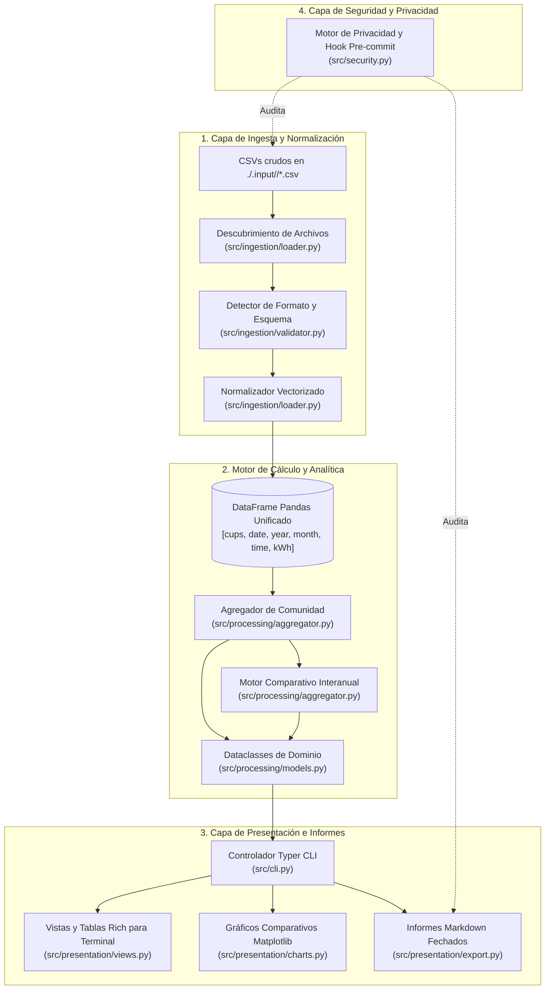

# 📘 DATADIS Analyzer — Guía Técnica de Arquitectura y Operación

> Guía exhaustiva y didáctica para entender cómo DATADIS Analyzer (`da`) descubre, valida, procesa y visualiza datos de consumo horario de electricidad para comunidades de propietarios.

---

> [!IMPORTANT]
> ### 🪢 Arnés de Mantenimiento Documental y Directiva de Sincronización
> Esta guía constituye la referencia técnica oficial para desarrolladores, administradores de fincas y agentes autónomos de IA.
> **Siempre que se realicen modificaciones en el código fuente, DEBE verificarse y actualizarse esta documentación si los cambios afectan a:**
> 1. **Esquemas de Entrada o Formatos de Archivo:** Modificaciones en columnas obligatorias, codificaciones, formatos de fecha o estructura de directorios en [`src/config.py`](file:///Users/marcos/workspace/repo/datadis-analyzer/src/config.py) y [`src/ingestion/`](file:///Users/marcos/workspace/repo/datadis-analyzer/src/ingestion/).
> 2. **Matemáticas de Procesamiento e Invariantes:** Ajustes en la fórmula de reparto del 100,00%, comprobaciones de completitud de meses de calendario o agregaciones en [`src/processing/aggregator.py`](file:///Users/marcos/workspace/repo/datadis-analyzer/src/processing/aggregator.py).
> 3. **Heurísticas de Clasificación:** Cambios en los distintivos de consumidores (`★` dominante $>30\%$, `(0)` inactivo $<1\text{ kWh}$) en [`src/presentation/views.py`](file:///Users/marcos/workspace/repo/datadis-analyzer/src/presentation/views.py).
> 4. **Comandos y Opciones CLI:** Nuevos subcomandos, banderas o formatos de informe en [`src/cli.py`](file:///Users/marcos/workspace/repo/datadis-analyzer/src/cli.py).
> 5. **Invariantes de Privacidad y Seguridad:** Revisiones en los patrones de CUPS sintéticos autorizados o reglas del auditor en [`src/security.py`](file:///Users/marcos/workspace/repo/datadis-analyzer/src/security.py).

---

## 1. 🎯 Propósito y Principios Fundamentales

### ¿Qué es DATADIS?
En España, **DATADIS** ([datadis.es](https://datadis.es)) es la plataforma digital unificada operada por las empresas distribuidoras de electricidad que permite a los consumidores y administradores acceder a las lecturas horarias de los contadores eléctricos.

### El Desafío en Comunidades de Propietarios
En los edificios residenciales (*comunidades de vecinos*), coexisten simultáneamente múltiples puntos de suministro:
- Viviendas individuales de los propietarios.
- Servicios comunes generales (ascensores, climatización centralizada/aerotermia, bombas de achique o presión, iluminación y ventilación de garajes, depuradoras de piscina, iluminación de zonas comunes).

Cada punto de suministro cuenta con exportaciones CSV horarias independientes que contienen hasta **8.760 lecturas horarias por año**. Dichos archivos presentan con frecuencia delimitadores heterogéneos (`;` frente a `,`), diversas codificaciones de caracteres (`UTF-8` frente a `ISO-8859-1`) y formatos numéricos locales con coma decimal (`0,152`).

`datadis-analyzer` (`da`) elimina la complejidad manual de consolidar estos archivos dispersos, proporcionando:
1. **Descubrimiento e Ingesta Automatizados:** Lectura segura de exportaciones CSV crudas sin necesidad de formateo previo.
2. **Reparto Porcentual Equitativo:** Cálculo matemático exacto de la cuota de participación energética de cada suministro.
3. **Comparativas Interanuales Homogéneas:** Análisis riguroso entre años que detecta y aísla meses incompletos o en curso.
4. **Visualizaciones Enriquecidas e Informes Markdown:** Paneles gráficos para terminal e informes persistentes de auditoría.
5. **Privacidad Absoluta con Cero Filtraciones:** Bloqueo estricto para evitar comprometer códigos reales de puntos de suministro (CUPS).

---

## 2. 🏛️ Visión Arquitectónica y Ciclo de Vida del Dato

La aplicación sigue un flujo unidireccional por capas: desde los archivos CSV sin procesar en disco hasta DataFrames normalizados, modelos de dominio estructurados y capas de presentación.

---

## 3. 📥 Canal de Ingesta de Datos (Cómo Obtiene la Información)

El canal de ingesta transforma archivos CSV heterogéneos en un DataFrame de Pandas estructurado y validado.

### A. Estructura de Directorios Anualizada
- **Directorio por Defecto:** Los archivos CSV se organizan por año bajo `./.input/<año>/` (por ejemplo, `./.input/2024/*.csv`, `./.input/2025/*.csv`).
- **Estrategia de Descubrimiento:** [`DatadisLoader.discover_files`](file:///Users/marcos/workspace/repo/datadis-analyzer/src/ingestion/loader.py#L34-L67) prioriza la carpeta del año solicitado. Si no se especifica filtro de año, explora recursivamente `./.input/`, ignorando archivos ocultos o copias de seguridad.

### B. Detección Inteligente de Formato y Esquema
Las exportaciones de DATADIS varían según la distribuidora que genera los datos. [`DatadisValidator`](file:///Users/marcos/workspace/repo/datadis-analyzer/src/ingestion/validator.py#L10-L147) detecta automáticamente estas divergencias:
1. **Detección de Codificación de Caracteres:** Evalúa variantes UTF-8 (`utf-8`, `utf-8-sig`) leyendo un bloque representativo de bytes, recurriendo de forma segura a Latin-1 (`iso-8859-1` / `cp1252`) si falla.
2. **Detección de Delimitador:** Cuenta los separadores candidatos (`;`, `,`, `\t`) en la cabecera, dando prioridad al punto y coma estándar (`;`) y utilizando `csv.Sniffer` como respaldo.
3. **Verificación de Columnas Obligatorias:** Exige que todo archivo cuente con los cuatro campos indispensables:
   - `cups`: Código Unificado de Punto de Suministro.
   - `fecha`: Fecha del registro.
   - `hora`: Intervalo horario (`01:00` a `24:00`).
   - `consumo_kWh`: Energía consumida en kilovatios-hora.

### C. Normalización Vectorizada del DataFrame
En [`DatadisLoader.load_file`](file:///Users/marcos/workspace/repo/datadis-analyzer/src/ingestion/loader.py#L69-L150), los datos se procesan en memoria:
1. **Carga Segura como Texto (`dtype=str`):** Carga todas las columnas como cadenas de texto para evitar errores prematuros de redondeo o conversiones inválidas.
2. **Estandarización de Cabeceras:** Mapea variaciones de mayúsculas/minúsculas (`consumo_kWh`, `consumoKwh`, `CONSUMO_KWH`) a identificadores internos estándar.
3. **Conversión de Decimales Europeos:** Sustituye comas decimales por puntos (`0,152` ➔ `0.152`) e imputa valores ausentes o corruptos como `0.0`.
4. **Interpretación Flexible de Fechas:** Aplica `pd.to_datetime(format="mixed")` para interpretar sin ambigüedades tanto formatos españoles (`DD/MM/YYYY`) como formatos ISO (`YYYY-MM-DD` o `YYYY/MM/DD`).
5. **Particionado Temporal:** Calcula columnas enteras `year` (año) y `month` (mes 1–12) para permitir agrupaciones vectorizadas inmediatas.

---

## 4. 🧮 Motor de Procesamiento y Agregación (Cómo Procesa la Información)

Una vez consolidadas las lecturas horarias en un único DataFrame, [`DataAggregator`](file:///Users/marcos/workspace/repo/datadis-analyzer/src/processing/aggregator.py#L26-L440) ejecuta los cálculos estadísticos y modelos de reparto.

### A. La Invariante Matemática del Reparto al 100,00%
Para cualquier ventana temporal $T$ (un mes individual, un año natural o el histórico completo), el porcentaje de participación de cada contador se calcula mediante la fórmula:

$$\text{Porcentaje}_i = \left( \frac{\sum_{t \in T} \text{kWh}_{i, t}}{\sum_{j \in \text{Comunidad}} \sum_{t \in T} \text{kWh}_{j, t}} \right) \times 100$$

> [!NOTE]
> La suma de los porcentajes de todos los CUPS de la comunidad en cualquier período $T$ equivale de manera matemáticamente garantizada a **$100,00\%$** (salvo redondeos visuales de coma flotante). Si el consumo comunitario es nulo, los porcentajes se fijan en $0,00\%$.

### B. Heurísticas de Clasificación de Consumidores
Para facilitar una rápida comprensión de los hábitos del edificio, el motor clasifica y etiqueta cada suministro:

| Clasificación | Distintivo / Símbolo | Condición de Umbral | Significado Práctico Habitual |
| :--- | :---: | :--- | :--- |
| **Consumidor Dominante** | `★` *(Magenta)* | $\text{Porcentaje}_i > 30,0\%$ (y posición #1) | Climatización centralizada, bombas de calor/achique, maquinaria de ascensor o servicios comunes de alta potencia. |
| **Consumidor Estándar** | *(Número de orden)* | $1,0\text{ kWh} \le \text{Consumo} \le 30,0\%$ | Vivienda particular o local comercial habitual. |
| **Suministro Inactivo / Latente** | `(0)` *(Atenuado)* | $\text{Consumo} < 1,0\text{ kWh}$ | Piso desocupado, suministro de temporada o contador dado de baja temporalmente. |

### C. Motor de Comparación Interanual (La Heurística Homogénea)
Al comparar varios años con `da compare`, contrastar períodos incompletos (por ejemplo, un año en curso con solo 15 días de mayo frente a un mayo cerrado de 31 días de un año anterior) arrojaría variaciones porcentuales engañosas.

Para evitar conclusiones erróneas, [`DataAggregator.compare_years`](file:///Users/marcos/workspace/repo/datadis-analyzer/src/processing/aggregator.py#L224-L440) aplica una **Heurística de Completitud de Meses de Calendario**:

1. **Verificación de Días:** Para cada mes de calendario $m \in \{1 \dots 12\}$, se calcula mediante `calendar.monthrange(año, m)[1]` el número exacto de días naturales que corresponden a ese año específico (gestionando automáticamente los años bisiestos).
2. **Clasificación del Estado del Mes:**
   - **`complete` (completo):** Existen lecturas para todos los días naturales del mes (`días_reales == días_esperados`).
   - **`incomplete` (incompleto):** Se registran menos días de los esperados (`días_reales < días_esperados`).
   - **`no_data` (sin datos):** Cero registros disponibles.
3. **Invariante de Variación:** Las diferencias absolutas ($\Delta\text{kWh}$) y las variaciones porcentuales ($\%\Delta$) se **calculan estrictamente sobre los meses que resultan completos en todos los años comparados**.
   $$\Delta\text{kWh}_m = \text{kWh}_{\text{año\_reciente}, m} - \text{kWh}_{\text{año\_base}, m} \quad (\text{solo si está completo en todos los años})$$
   $$\%\Delta_m = \left( \frac{\Delta\text{kWh}_m}{\text{kWh}_{\text{año\_base}, m}} \right) \times 100$$
4. Los meses incompletos se muestran en las tablas con etiquetas indicativas (`[Inc]`, `[--]`), pero se excluyen de los totales comparables para garantizar la validez del análisis.

---

## 5. 🖥️ Resultados Esperados y Capa de Presentación

La herramienta ofrece tres canales de presentación diseñados para ofrecer máxima claridad técnica:

### 1. Interfaz de Terminal Enriquecida (Estándar de 80 Columnas)
Construida con la librería [Rich](https://github.com/Textualize/rich), optimizada para terminales estándar de 80 columnas con ajuste estricto (`no_wrap=True`) en cifras:
- **Ficha Resumen de la Comunidad:** Consumo total acumulado, total de lecturas procesadas, número de contadores, y meses de mayor y menor demanda.
- **Tablas de Reparto Anual por CUPS:** Clasificación ordenada de suministros, kWh consumidos, cuota porcentual y barras gráficas de distribución (`make_share_bar`).
- **Trayectoria Mensual por Contador:** Evolución temporal mes a mes para un contador específico o para el conjunto del inmueble.
- **Tablas Comparativas Interanuales:** Columnas anuales paralelas con deltas codificados por color (verde para descensos de consumo, rojo para incrementos).

### 2. Gráficos Comparativos en Alta Resolución (`.output/charts/*.png`)
Generados mediante [Matplotlib](https://matplotlib.org) con renderizado sin entorno gráfico (`Agg`) y almacenados en `./.output/charts/`:
- **Gráfico Comparativo Comunitario (`community_monthly_<años>.png`):** Diagrama de barras agrupadas comparando el consumo global en los 12 meses de calendario.
- **Gráficos Comparativos por CUPS (`<CUPS>_monthly_<años>.png`):** Diagramas independientes de evolución mensual para cada contador del edificio.

### 3. Informes Resumen en Markdown (`.output/*.md`)
Informes de auditoría exportados en formato Markdown estándar con fecha y hora:
- Nombres de archivo estandarizados: `AAAAMMDD_HHMMSS_community_summary.md` o `AAAAMMDD_HHMMSS_comparison_<años>.md`.
- Barras gráficas en formato ASCII (`████░░░░░░░░`).
- Enlaces integrados a las imágenes PNG generadas.
- Inclusión de la versión activa de CalVer, marca temporal de ejecución y notas de privacidad legal.

---

## 6. 🔒 Motor de Seguridad y Anonimización de Datos

Conforme al Real Decreto español **RD 1435/2002** y el Reglamento General de Protección de Datos de la Unión Europea (**RGPD** / Reglamento UE 2016/679), el Código Unificado de Punto de Suministro (CUPS) es un dato de carácter personal al identificar inequívocamente un inmueble físico.

### Invariantes de Cero Filtraciones
[`src/security.py`](file:///Users/marcos/workspace/repo/datadis-analyzer/src/security.py) garantiza que ningún dato residencial real se suba jamás al repositorio Git:

1. **Lista Blanca de CUPS Sintéticos:** Únicamente se admiten identificadores simulados que coincidan con patrones aprobados:
   - `ES0021000000000001AA` hasta `ES0021000000009999ZZ`
   - Todo ceros (`ES0000000000000000AA`) o todo nueves (`ES9999999999999999ZZ`)
2. **Bloqueo de Coordenadas y Direcciones:** Detección de pares de coordenadas decimales o formato DMS que identifiquen ubicaciones físicas de inmuebles.
3. **Protección de Credenciales:** Búsqueda y bloqueo de certificados privados, tokens de API, credenciales de AWS, GitHub PATs o Bearer tokens.
4. **Ejecución Automatizada:** Disponible tanto mediante comando CLI (`python -m src.security`) como a través del hook pre-commit de Git en [`.pre-commit-config.yaml`](file:///Users/marcos/workspace/repo/datadis-analyzer/.pre-commit-config.yaml).
5. **Aislamiento en Git:** Los directorios con datos reales del usuario (`.input/`) y los informes generados (`.output/`) están permanentemente ignorados en [`.gitignore`](file:///Users/marcos/workspace/repo/datadis-analyzer/.gitignore).

---

## 7. 🗺️ Índice de Trazabilidad en el Código

Utilice esta tabla para localizar rápidamente la implementación de cada concepto en el código:

| Concepto / Funcionalidad | Archivo Principal | Clase / Función Clave |
| :--- | :--- | :--- |
| **Controlador y Despacho CLI** | [`src/cli.py`](file:///Users/marcos/workspace/repo/datadis-analyzer/src/cli.py) | `app`, `summary_cmd`, `compare_cmd`, `init_cmd` |
| **Configuración Persistente** | [`src/config.py`](file:///Users/marcos/workspace/repo/datadis-analyzer/src/config.py) | `AppConfig`, `load_config`, `set_language` |
| **Motor de Versiones CalVer** | [`src/version.py`](file:///Users/marcos/workspace/repo/datadis-analyzer/src/version.py) | `get_version`, `bump_version_files`, `check_commit_version_bump` |
| **Auditoría de Seguridad y Privacidad** | [`src/security.py`](file:///Users/marcos/workspace/repo/datadis-analyzer/src/security.py) | `audit_repository`, `scan_content`, `is_allowed_synthetic_cups` |
| **Descubrimiento y Normalización CSV** | [`src/ingestion/loader.py`](file:///Users/marcos/workspace/repo/datadis-analyzer/src/ingestion/loader.py) | `DatadisLoader.discover_files`, `DatadisLoader.load_file` |
| **Detector de Formato y Esquema** | [`src/ingestion/validator.py`](file:///Users/marcos/workspace/repo/datadis-analyzer/src/ingestion/validator.py) | `DatadisValidator.detect_delimiter`, `validate_file` |
| **Cálculo de Agregación y Reparto** | [`src/processing/aggregator.py`](file:///Users/marcos/workspace/repo/datadis-analyzer/src/processing/aggregator.py) | `DataAggregator.aggregate_community`, `_calculate_cups_shares` |
| **Motor Comparativo Interanual** | [`src/processing/aggregator.py`](file:///Users/marcos/workspace/repo/datadis-analyzer/src/processing/aggregator.py) | `DataAggregator.compare_years` |
| **Modelos de Dominio de Datos** | [`src/processing/models.py`](file:///Users/marcos/workspace/repo/datadis-analyzer/src/processing/models.py) | `CommunitySummary`, `CupsShare`, `ComparisonSummary` |
| **Vistas de Terminal Enriquecidas** | [`src/presentation/views.py`](file:///Users/marcos/workspace/repo/datadis-analyzer/src/presentation/views.py) | `render_annual_tables`, `render_monthly_overview`, `render_help` |
| **Generación de Gráficos Matplotlib** | [`src/presentation/charts.py`](file:///Users/marcos/workspace/repo/datadis-analyzer/src/presentation/charts.py) | `generate_all_comparison_charts`, `generate_community_bar_chart` |
| **Exportador de Informes Markdown** | [`src/presentation/export.py`](file:///Users/marcos/workspace/repo/datadis-analyzer/src/presentation/export.py) | `export_markdown_summary`, `export_comparison_markdown` |
| **Motor de Idiomas (i18n)** | [`src/i18n.py`](file:///Users/marcos/workspace/repo/datadis-analyzer/src/i18n.py) | `t()`, `get_month_name()`, `TRANSLATIONS` |
